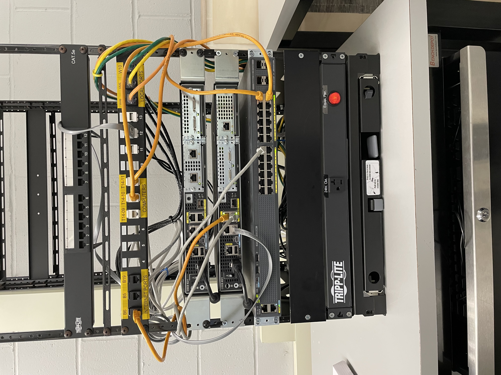
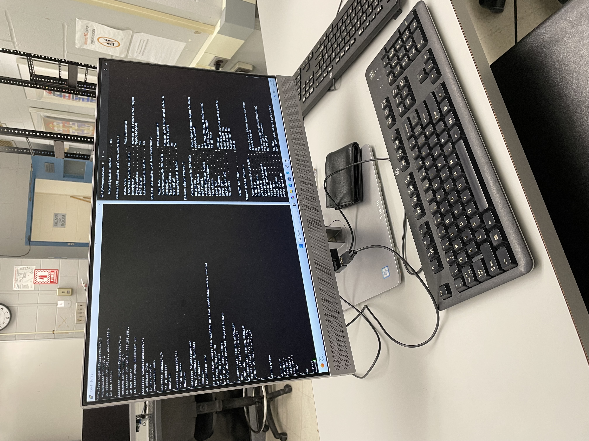
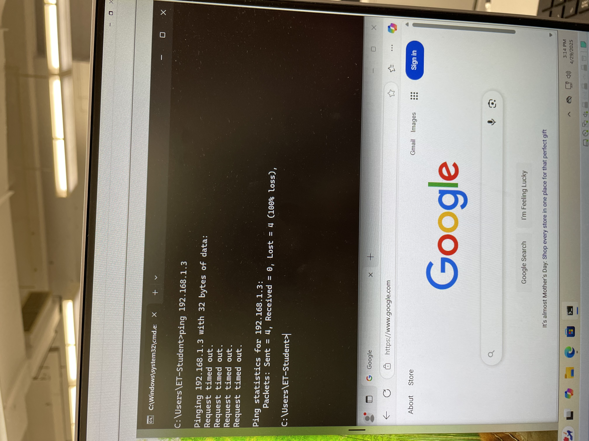

# Cisco VLAN Routing with DHCP and NAT Overload

## Overview

This project demonstrates the configuration of a Cisco router and managed switch to support inter-VLAN routing, DHCP-based IP address assignment, NAT overload (PAT) for internet access, and ACL-based traffic restrictions between VLANs.

Both VLAN 2 and VLAN 3 were configured with isolated IP subnets. DHCP pools were created on the router to serve hosts dynamically, and an optional ACL was applied to restrict VLAN2 from accessing VLAN3. The final setup allowed both VLANs to access the internet while maintaining selective internal segmentation.

## Physical Topology

## Logical Topology

## Configurations

### Switch
- VLAN 2 and VLAN 3 created
- Access ports assigned for each VLAN
- Trunk port configured towards router

[`switch/Switch configuration.txt`](switch/Switch%20configuration.txt)

### Router
- Subinterfaces with 802.1Q encapsulation for each VLAN
- DHCP pools assigned to VLAN2 and VLAN3
- NAT Overload (PAT) configured for external internet access
- ACL applied to block VLAN2 from reaching VLAN3 (optional)

- [`router/Router configuration.txt`](router/Router%20configuration.txt) — Basic setup  
- [`router/Router configuration with access-li.txt`](router/Router%20configuration%20with%20access-li.txt) — Setup with ACL blocking  
- [`router/Router DHCP binding.txt`](router/Router%20DHCP%20binding.txt) — DHCP bindings  
- [`router/Router NAT translations.txt`](router/Router%20NAT%20translations.txt) — NAT table snapshot

## Validation

### VLAN2 VM – DHCP Lease and Configuration

### VLAN3 VM – DHCP Lease and Configuration

### VLAN3 Host Trying to Ping VLAN2 after applying ACL 

## Technologies Used

- Cisco Router and Managed Switch (CLI Configuration)
- VLAN Configuration and Trunking (802.1Q)
- Router-on-a-Stick Inter-VLAN Routing
- DHCP Pools on Router
- NAT Overload (PAT) for Internet Access
- ACL for Inter-VLAN Access Control

## Notes

- Configurations saved after successful validation
- DHCP leases and NAT sessions captured live
- Physical workstation setup captured for reference
